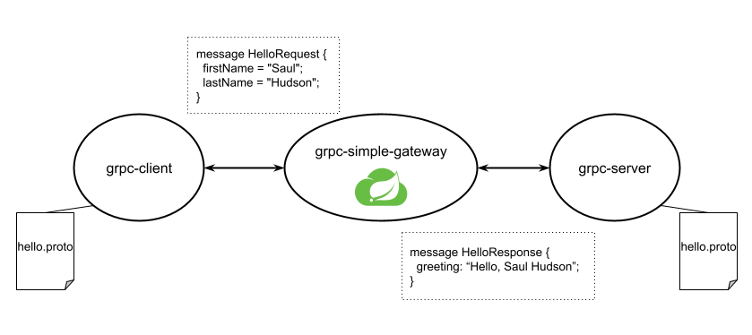
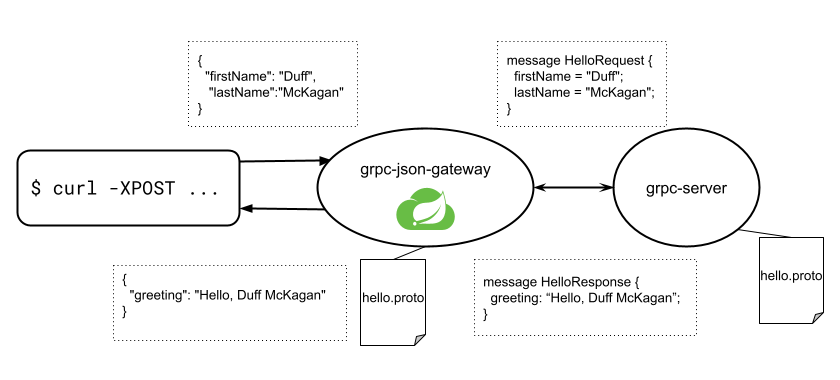

= Spring Cloud Gateway and gRPC

Starting from `3.1.0-RC1`, Spring Cloud Gateway included support for gRPC and HTTP/2.

We will introduce the basic concepts behind gRPC and how to configure it with two examples:

* One that showcases how Spring Cloud Gateway can transparently re-route gRPC traffic without needing to know the proto definition and without having to modify our existing gRPC servers.

* Another that showcases how we can create a custom filter in Spring Cloud Gateway to transform a JSON payload to a gRPC message.

== Introduction to gRPC and HTTP/2

HTTP/2 makes our applications faster, simpler, and more robust. Reducing latency by enabling request and response
multiplexing, adding efficient compression of HTTP header fields, and adding support for request prioritization and
server push.

The reduction in the number of connections is particularly important when improving the performance of HTTPS: that way
we have less expensive TLS handshakes, more efficient session reuse, reducing client and server resources.

HTTP/2 provides two mechanisms for negotiating the application level protocol:

* `H2C` HTTP/2.0 support with clear-text
* `H2` HTTP/2.0 support with TLS

Even though `reactor-netty` has support for `H2C` clear-text protocol, Spring Cloud Gateway requires `H2` with TLS to
assure transport security.

HTTP/2 adds a binary framing layer, which is how the HTTP messages are encapsulated and transferred between the client
and server, enabling more efficient ways to transfer data.

Thanks to https://github.com/reactor/reactor-netty[reactor-netty] and its HTTP/2 support, we were able to extend
Spring Cloud Gateway to support gRPC.

https://grpc.io/[gRPC] is a high-performance Remote Procedure Call framework that can run in any environment. It
provides bi-directional streaming, and it's based on HTTP/2.

gRPC services can be defined using Protocol Buffers, a powerful binary serialization toolset and language, and
provides tools for generating clients and servers across different languages.

== Getting started

In order to enable gRPC in Spring Cloud Gateway, we need to enable HTTP/2 and SSL in our project https://docs.oracle.com/cd/E19830-01/819-4712/ablqw/index.html[by adding a keystore], this can be done
through configuration by adding the following:

[source,yaml]
----
server:
  http2:
    enabled: true
  ssl:
    key-store-type: PKCS12
    key-store: classpath:keystore.p12
    key-store-password: password
    key-password: password
    enabled: true

----

Now that we have it enabled, we can create a route that redirects traffic to a gRPC server and take advantage of the
existing filters and predicates, for example, this route will redirect traffic that comes from any path starting
with `grpc` to a local server in the port `6565` and add header `X-Request-header` with the value `header-value`:

[source,yaml]
----
spring:
  cloud:
    gateway:
      routes:
        - id: grpc
          uri: https://localhost:6565
          predicates:
            - Path=/grpc/**
          filters:
            - AddResponseHeader=X-Request-header, header-value
----

== Running gRPC to gRPC

An end to end example can be found in this repository with the following parts:

* A `grpc-server` that exposes a `HelloService`, and gRPC endpoint to receive a `HelloRequest` and return
 a `HelloResponse`:
[source,protobuf]
----
syntax = "proto3";

message HelloRequest {
  string firstName = 1;
  string lastName = 2;
}

message HelloResponse {
  string greeting = 1;
}

service HelloService {
  rpc hello(HelloRequest) returns (HelloResponse);
}
----

The server will concatenate a salutation with `firstName` and a `lastName` and respond with a `greeting`.

For example, this input:

[source,text]
----
firstName: Saul
lastName: Hudson
----

Will output:

[source,text]
----
greeting: Hello, Saul Hudson
----

* A `grpc-client`, in charge of sending the `HelloRequest` to the `HelloService`.

* `grpc-simple-gateway` that routes the requests and adds a header with the configuration mentioned above. Note that this gateway application does not have any dependency to gRPC nor to the proto definition used by client and server.

At the moment there is just one route that will forward everything to the `grpc-server`:

[source,yaml]
----
      routes:
        - id: grpc
          uri: https://localhost:6565
          predicates:
            - Path=/**
          filters:
            - AddResponseHeader=X-Request-header, header-value
----

To start the server that is going to be listening to requests:

[source,shell]
----
 ./gradlew :grpc-server:bootRun
----

Then, we start the gateway that is going to re-route the gRPC requests:

[source,shell]
----
./gradlew :grpc-simple-gateway:bootRun
----

Finally, we can use the client that points to the gateway application:

[source,shell]
----
./gradlew :grpc-client:bootRun
----

The gateway routes and filters can be modified in `grpc-simple-gateway/src/main/resources/application.yaml`

== Running JSON to gRPC with a custom filter

Thanks to Spring Cloud Gateway flexibility, it is possible to create a custom filter to transform from a JSON payload to
a gRPC message.

Even though it will have a performance impact since we have to serialize and deserialize the requests in the gateway and creating a channel from it,
it is a common pattern if you want to expose a JSON API while maintaining internal compatibility.

For that, we can extend our `grpc-json-gateway` to include the `proto` definition with the message we want to send.

Spring Cloud Gateway contains a mechanism to create custom filters allowing us to intercept requests and add custom logic to them.

For this particular scenario, we are going to deserialize the JSON request and create a gRPC channel that will send a message to the `grpc-server`.

[source,java]
----
static class GRPCResponseDecorator extends ServerHttpResponseDecorator {

  @Override
  public Mono<Void> writeWith(Publisher<?extends DataBuffer> body) {
    exchange.getResponse().getHeaders().set("Content-Type", "application/json");

    URI requestURI = exchange.getRequest().getURI();
    ManagedChannel channel = createSecuredChannel(requestURI.getHost(), 6565);

    return getDelegate().writeWith(deserializeJSONRequest()
            .map(jsonRequest -> {
                String firstName = jsonRequest.getFirstName();
                String lastName = jsonRequest.getLastName();
                return HelloServiceGrpc.newBlockingStub(channel)
                        .hello(HelloRequest.newBuilder()
                                .setFirstName(firstName)
                                .setLastName(lastName)
                                .build());
            })
            .map(this::serialiseJSONResponse)
            .map(wrapGRPCResponse())
            .cast(DataBuffer.class)
            .last());
  }
}
----

The full implementation can be found
in: `grpc-json-gateway/src/main/java/com/example/grpcserver/hello/JSONToGRPCFilterFactory.java`

Using the same `grpc-server`, we can start the gateway with the custom filter with:

[source,shell]
----
./gradlew :grpc-json-gateway:bootRun
----

And send JSON requests to the `grpc-json-gateway` using, for example, `curl`:

[source,bash]
----
curl -XPOST 'https://localhost:8091/json/hello' -d '{"firstName":"Duff","lastName":"McKagan"}' -k -H"Content-Type: application/json" -v
----

We see how the gateway application forwards the requests and returns the JSON payload with the new `Content-Type` header:

[source,bash]
----
< HTTP/2 200
< content-type: application/json
< content-length: 34
<
* Connection #0 to host localhost left intact
{"greeting":"Hello, Duff McKagan"}
----

== Next Steps

In this post, we've looked at a few examples of how gRPC can be integrated within Spring Cloud Gateway. I’d love to know
what other usages you've found to be helpful in your experiences.